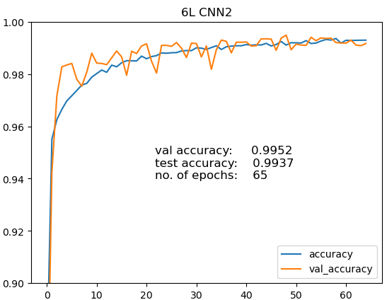

# Computer Vision with MNIST dataset

## General info

In this project we operate on classical MNIST dataset - gray-scale images of hand-drawn digits, from zero through nine. Every image is 784 pixels total: 28x28. We are provided with 42000 labeled training set and 28000 test. Our goal is to predict correct number from image. The result will be evaluated based on accuracy - precentage of correctly predicted images.

For more information visit:

[Kaggle project's site](https://www.kaggle.com/competitions/digit-recognizer)

[MNIST Wikipedia](https://en.wikipedia.org/wiki/MNIST_database)

## Project plan and goals

In this project I use Python3 in Jupyter Notebook. For data preparation and visaulization standard libraries like numpy, pandas and matplotlib are used. Main goal of this project is to get familiar with Neural Networks using Tensorflow/Keras framework. I want to experiment with different network architectures and adjust other parameters in order to reach as good accuracy score as possible. I will focus on Fully Connected Neural Networks and Convolutional Neural Networks.

## Final result

Both, Fully Connected and Convolutional Neural Networks achieved accuracy higher than 99%. As could be expected, best model was CNN. In our case it has six convolutional hidden layers and one FC layer. Batch normalization and dropout are used. In all models, adding data augmentation gave significant boost in accuracy. Best model has test accuracy of 99.37% which placed it in top 10% on Kaggle's Leaderboard. Visualization of training process can be seen on picture below:

[>>> To inspect my project in details, click here to visit .ipynb file <<<](https://github.com/maciekr91/Computer-Vision-with-MNIST-dataset/blob/main/project%20MNIST.ipynb)

